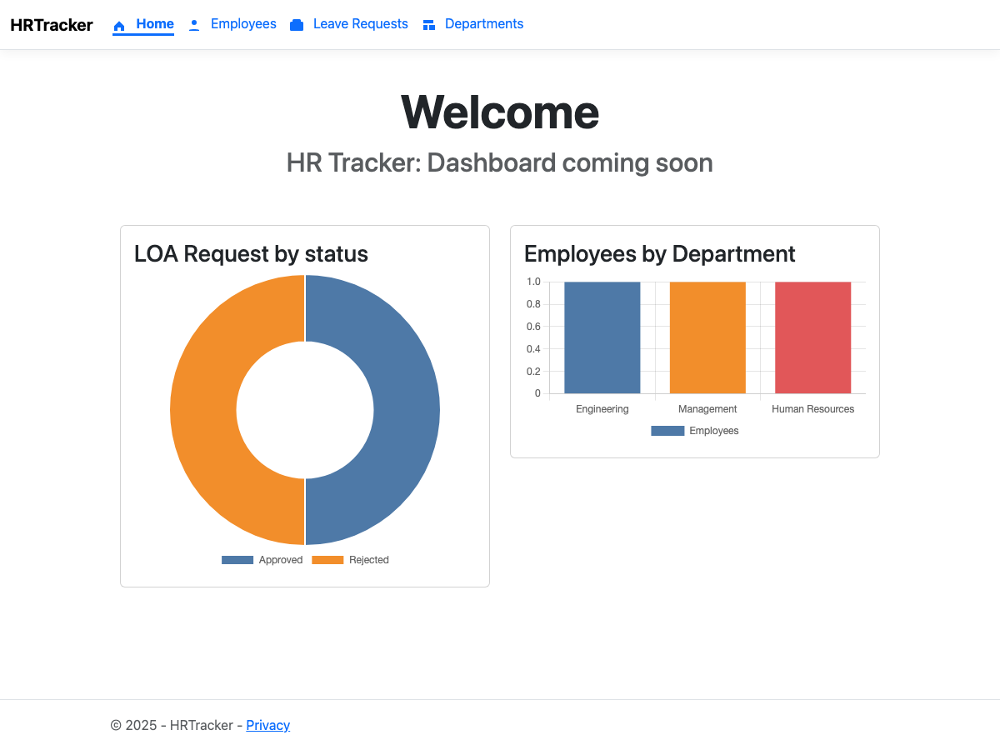

# Human Resource Tracker

A modern Human Resource Management System built with ASP.NET Core MVC and Entity Framework Core. This application provides a comprehensive solution for managing employee data, tracking HR metrics, and streamlining HR operations.



## 🚀 Features

- **Employee Management** - Add, edit, and manage employee records
- **Dashboard Analytics** - Visual insights into HR metrics and statistics
- **Database Flexibility** - SQLite for development, SQL Server for production
- **Responsive Design** - Modern UI with Tailwind CSS
- **Accessibility Focused** - Built with web accessibility standards in mind

## 🛠️ Tech Stack

- **Framework**: . NET 9.0
- **Architecture**: ASP.NET Core MVC
- **ORM**: Entity Framework Core 9.0
- **Database**:  
  - SQLite (Development)
  - SQL Server (Production)
- **Frontend**: 
  - Tailwind CSS
  - JavaScript
- **Build Tools**: PostCSS, npm

## 📋 Prerequisites

- [. NET 9.0 SDK](https://dotnet.microsoft.com/download/dotnet/9.0)
- [Node.js](https://nodejs.org/) (for frontend asset compilation)
- SQL Server (for production deployment) or SQLite (included for development)

## 🔧 Installation

1. **Clone the repository**
   ```bash
   git clone https://github.com/bkeller2890/Human-Resource-Tracker.git
   cd Human-Resource-Tracker
   ```

2. **Install . NET dependencies**
   ```bash
   dotnet restore
   ```

3. **Install Node.js dependencies**
   ```bash
   npm install
   ```

4. **Update database connection string** (optional)
   
   Edit `appsettings.json` or `appsettings.Development.json` to configure your database connection. 

5. **Apply database migrations**
   ```bash
   dotnet ef database update
   ```

## 🚀 Running the Application

### Development Mode

```bash
dotnet run
```

The application will be available at `https://localhost:5001` or `http://localhost:5000`.

### Production Build

```bash
dotnet publish -c Release
```

## 📁 Project Structure

```
Human-Resource-Tracker/
├── Controllers/        # MVC Controllers
├── Data/              # DbContext and data access layer
├── Extensions/        # Extension methods and helpers
├── HostedServices/    # Background services
├── Migrations/        # EF Core migrations
├── Models/            # Data models and view models
├── TagHelpers/        # Custom tag helpers
├── Utils/             # Utility classes
├── Views/             # Razor views
├── wwwroot/           # Static files (CSS, JS, images)
├── docs/              # Documentation
└── tools/             # Development tools and scripts
```

## 🗄️ Database

The application uses a dual-database approach:
- **Development**:  SQLite database (`hrtracker.db`)
- **Production**: SQL Server

Entity Framework Core manages database migrations and schema updates.

## 🧪 Testing

Accessibility and performance testing reports are available: 
- Lighthouse report:  `lighthouse-report.json`
- Axe accessibility report: `axe-report.json`

## 🤝 Contributing

Contributions are welcome! Please follow these steps:

1. Fork the repository
2. Create a feature branch (`git checkout -b feature/AmazingFeature`)
3. Commit your changes (`git commit -m 'Add some AmazingFeature'`)
4. Push to the branch (`git push origin feature/AmazingFeature`)
5. Open a Pull Request

## 📝 License

This project is available for use under standard open-source practices.  Please check with the repository owner for specific licensing details.

## 👤 Author

**bkeller2890**
- GitHub: [@bkeller2890](https://github.com/bkeller2890)

## 🙏 Acknowledgments

- Built with ASP.NET Core MVC
- Styled with Tailwind CSS
- Database management with Entity Framework Core

---

⭐ Star this repository if you find it helpful!
